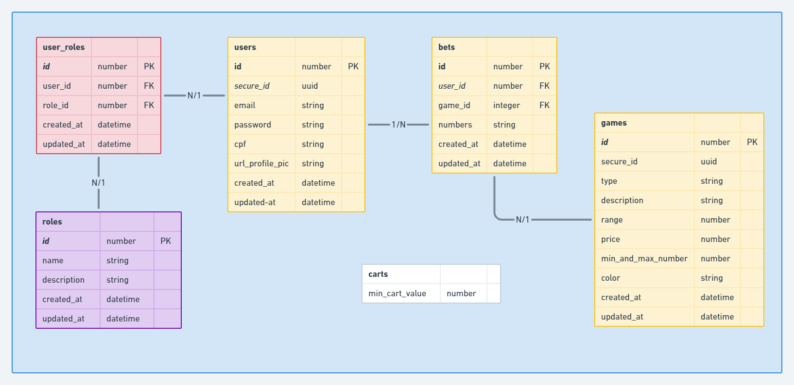

Requisitos Não Funcionais

     RNF01. Construir toda aplicação utilizando Adonis V5

     RNF02. Construir banco de dados com base no JSON (Em Anexo) 

     RNF03. Utilizar validators

     RNF04. Utilizar Docker para manter a aplicação dentro de um container.

Requisitos Funcionais

     RF01. Disparar email para novos usuários, recuperação de senha e novas apostas (mailtrap)

     RF02. Login de usuários.

     RF03. CRUD de usuários

     RF04. CRUD de jogos

     RF05. CRUD de apostas (somente: store, show e index ) (obs: o cadastro precisa receber um carrinho de apostas de acordo com um valor mínimo setado em tabela para controlar regras das apostas) 

     RF06. Criar perfis de acesso (admin e player) e determinar rotas privadas.

     RF07. Criar uma scheduler para rodar todos os dias ás 09:00, disparando e-mails apenas para os players que não apostaram no prazo de 1 semana anterior ao dia atual convidando eles para fazer uma aposta. (Lib para a Cron )
     
    RF08: Ao buscar um usuário, é necessário trazer todas as apostas dele no último mês

Atenção: Antes de iniciar a prova, envie o DIAGRAMA DE BANCO DE DADOS para o seu líder.
Observação: caso não tenha conhecimento sobre diagramas, você pode estar entendendo através deste Vídeo 

Observação: deve-se construir uma collection no insomnia para ser compartilhado.

Após finalizar, notifique seu líder.

Em caso de dúvidas técnicas ou qualquer outro impedimento, comunique seu líder!

## Diagrama de base Modelo relacional

